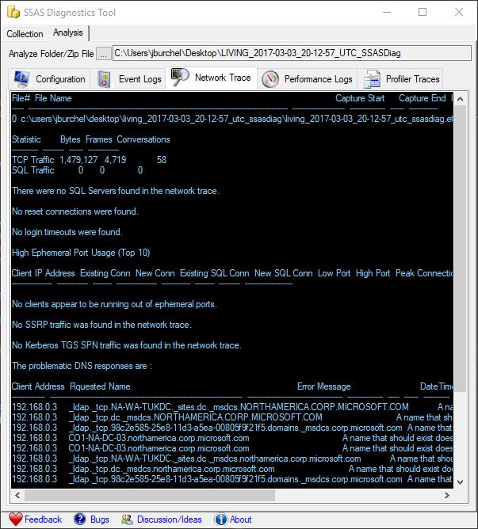
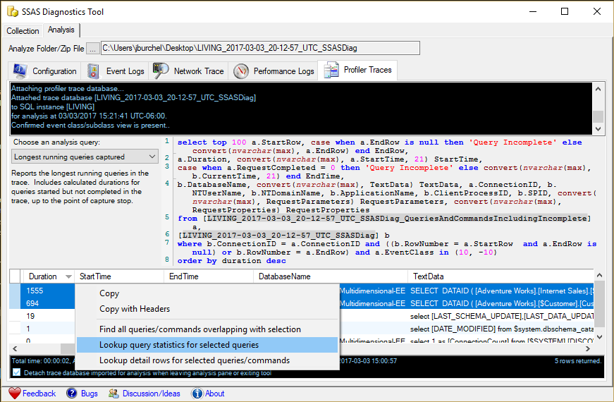
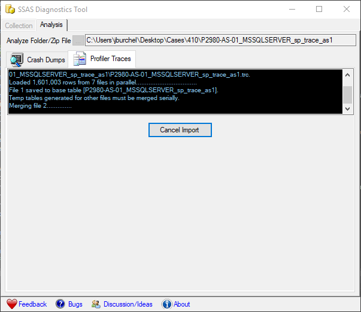
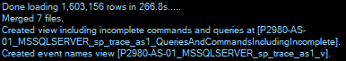

# SSAS Diagnostics Analyzer
The SSAS Diagnostics Tool (SSASDiag.exe) in its most recent release provides a significant Analysis feature.  Initially it implements two highest priority analyzers.
## General features of the Analyzer
The Analyzer feature automatically exposes available analyses for each of its collected data types.  After initial analysis or load of data is performed by a specific data type's analyzer, subsequent analysis does not require the initial load to be immediately accessed again.  This can be a significant time savings for large traces that may be multiple GB in size.  The analyzers automatically save their analysis and imported data back into any .zip file generated by the tool from which they are obtained, or into a folder adjacent the files if obtained from a folder or specific file selection.  The tool supports opening .zip files or folders generated by the Collector, for all of their contained data, or specifically opening a file of any of its supported file types for analysis.
## Network Trace Analyzer
The Network Trace Analyzer tool scans a network trace and reports summary statistics, but also searches for a variety of errors and issues that can commonly disrupt network communications, listing their occurrences and locations in the trace.

## Profiler Trace Analyzer
The Analysis Services Profiler Trace analyzer feature imports a SQL Profiler trace against Analysis Services into a local database for analysis, and exposes 11 initial analysis queries exposing deep insights into the trace.  These queries' results subsequently expose right-click functionality to support various extended analyses beyond the initial queries, allowing 60 unique combinations of paths through the data.  By combining these there are unlimited combinations of questions the user can ask and answer about the content in the trace. 

_Currently the Profiler Trace _Analyzer_ component of the tool requires the SQL 2016 Management Tools, and a local SQL instance (of any release 2008 or greater) on which the user is a SQL administrator, in order to perform its analyses.  This dependency may be removed in a future release of the tool.  Data capture may still be performed without any 2016 dependencies, and analysis can be performed on any machine with the necessary requirements.  The 2016 Management Tools are available for direct download without any SQL license requirement at [https://go.microsoft.com/fwlink/?LinkID=840946](https://go.microsoft.com/fwlink/?LinkID=840946)._
### Key Features of the Profiler Trace Analyzer
* Import of the trace to a portable database.
	* Additional SQL tables are created and views exposed, to perform built-in translation of event names for the trace.  
	* The tool automatically detaches the analysis database created from its attached SQL instance whenever the user exits or loads another file/folder for analysis, or starts a new data collection from the Collection tab.  This keeps analysis portable.
	* The analysis database may optionally be left attached by unchecking the relevant checkbox in its status area, so the user can perform offline analysis at will.

* When the user captured diagnostics to a .zip file in the Collection tab options, the tool automatically infers the requirement for data compression.
	* Automatically embeds generated analysis database into the .zip output file, while removing the source .trc files from which it was obtained.  
		* The .mdf and .ldf files associated with the database are slightly larger uncompressed than the size of the traces.  When compressed, however, their size is nearly identical.  
		* Data size remains identical but after initial analysis the database is preserved for instant availability subsequently.  
		* For large traces requiring hours even to load, this feature can be very advantageous for sharing of analysis and consultation/review with others investigating the same issue.  
		* If data was loaded from .trc file or collection folder, however, the .trc file is preserved, in the event it is required for any other purpose by the user.  The user can delete it at will, and as long as the created database is present in the analysis folder when reopened in the future, the tool will load it instead of searching for its associated .trc files.

* The tool's underlying import implementation for loading Profiler traces to database exposes the related Profiler Trace Importer tool's multithreaded functionality to dramatically improve trace load time.
	* One parallel thread is spawned for each file to be loaded, up to twice the number of available cores in the environment.  
	* With rollover traces having numerous files, **+this can often impact load time dramatically, reducing it as much as 90% in some conditions+**.
	* This sample trace with a very modest 7 rollover files loaded from start to finish in 266s, just under 4.5m, requiring no further user interaction after it was initiated in the tool:
>{}>

>{}>
	* Loading the same file in SQL Profiler consumed 4m to initially open (even changing the default setting not to prompt for rollover on each file), and then required user interaction to kick off the next phase to import to table, requiring 13m additionally then.  **+Even in this modest trace, the parallel import improved load time by almost 75%+**, in addition to removing user interaction requirement requirement midway through the load.

* Reports the SQL analysis query constructed against the generated trace database.  
>{}>
	* Generated analysis queries can be quite complex, time consuming, and difficult to compose on demand even for experienced questioners.  The tool empowers users by automatically creating them on demand for the specific trace in question.  
	* Exposing the query directly allows the user to easily copy and paste directly into a query tool like SQL Management Studio, modifying the base forms at will to suit any specific questions relating to a given scenario or trace, which may extend beyond the canned initial analyses the tool provides directly.  
	* Provides a deep launching off point for the user, allowing them to go as deep subsequently as necessary then.  Often required answers are found in the scope of the immediate analyses provided within the tool though, sparing the questioner from manually performing analyses in many cases entirely.
	* Users performing deeper analysis directly with queries of their own can then easily use the same view to engage the same functionality without having to rewrite it to obtain their answers with the same depth and expanded scope.

* Automatic interpretation and calculated durations for incompleted queries and jobs.
	* Most common superficial trace analyses involve looking for end events on queries and commands, to retrieve their timings.  This is a very useful simple thing to extract from a trace.  
	* What is much more difficult is to identify those queries and commands not completed before the trace was stopped, which therefore have no end events or associated timings.  Missing these can often mean an offending long running query or job (very often the root cause in a blocking scenario, for example) may be missed.
	* It is possible to construct queries that look for incompleted start events and then calculate their estimated duration at least until the end of the trace, so they will not be missed.  These queries are non-trivial to construct though, and rarely used in practice.  
	* All generated analysis queries provide this functionality.  The generated trace database contains a view exposing the list of all queries and commands, including those not completed, with their durations, or calculated durations respectively.

----
# Future Goals
* Analysis of Performance Monitor logs, and integration of analysis between analyzers.  For example, right-click functionality can be expanded to include lookups for relevant performance log information for a query, or for relevant queries associated with the PerfMon analysis, in both directions.  Logs will be imported into the same analysis database already used for Profiler Analysis, so analysis queries can simply crossjoin across tables to find powerful insights.
* Similarly for network traces, the functionality to lookup associated sessions overlapping a given query, or vice versa, identify a query in the profiler trace from its associated session found in the network trace, will expand functionality beyond simple explicit analysis of each data type alone.  This functionality will cross join the analytical capability of the tool, significantly extending its reach to find meaningful conclusions from very complex diagnostic datasets its collects.  Network traces will be similarly imported to the same analysis database we already generate, and will use universally to cross join all analyses from each data type ultimately.
* Analysis of event logs, instance configuration, and even crash dumps collected.
* New diagnostic capture capability for less common scenarios, including BID traces, ODBC traces, ULS logs from SharePoint, and execution of several existing tools for connectivity troubleshooting.
* Expansion of existing Profiler Analyzer
	* Addition of new analysis queries
	* Back/forward functionality to quickly navigate
	* Cache query results so after initial loads when navigating, queries do not need to be re-executed.
	* Allow users to save views they generate through contextual clicking, to automatically include them in future analysis options.
* Automatic engagement with support, even to automate upload of large logs so even unattended large data captures can be directly delivered to an engineer at Microsoft for further analysis. (How will it work, TBD...)

User feedback has been one primary mechanism for improvements and discovery of issues, so please provide your suggestions if you have ideas or feedback about the tool!